# Physics & Astronomy Quiz TESTING

initial-push

## Tests done

>HTML validation

>CSS validation

>JS - script.js validation

For the script.js code, the validator flagged the following variables as "undefined": physicsQuestions, astronomyQuestions and allQuestions. This is due to the fact that these variable were placed in a seperate file - the questions.js file. 

>JS - Qestions validation

For the questions.js code, the validator flagged the allQuestions variable as "unused". However, this variable was only flagged this way due to it being used in a seperate file - the script.js file.

>Lighthouse - Desktop

>Lighthouse - Mobile

## Cross Platform Compatibility

The following functionality was verified across each browser:

Images and icons loaded correctly.
Buttons and external links functioned as expected.
The responsive layout adapted correctly to different screen sizes.
Fonts, colours, and styling were displayed consistently.
No visual or functional issues were identified.

>Google Chrome

>Mozilla Firefox - Developer Edition

>Opera GX

## User Stories

### Welcome Screen

As a user, I want to view a welcome screen so that I understand the purpose of the quiz

**Acceptance Criteria:**

- [x] The welcome screen is displayed when the website loads.
- [x] The page includes the quiz title and a brief description.
- [] A Start Quiz button is clearly visible.

**Implementation Tasks:**

- [x] Create the HTML structure for the welcome screen.
- [x] Style the welcome screen using CSS.

### Quiz Category

As a user, I want to select a quiz category (Physics, Astronomy, or Mixed) so that I can choose the topics I want to be tested on.

**Acceptance Criteria:**

- [x] The user can choose one category before starting the quiz.
- [x] The selected category determines which questions are displayed.
- [x] Selecting Mixed displays questions from both Physics and Astronomy.

**Implementation Tasks:**

- [x] Create category selection buttons or a dropdown menu.
- [x] Store the selected category in JavaScript.
- [x] Filter the question list based on the selected category.

>Catrgories Test
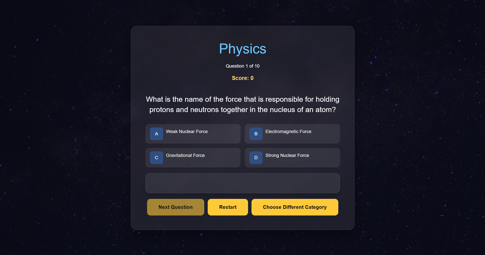

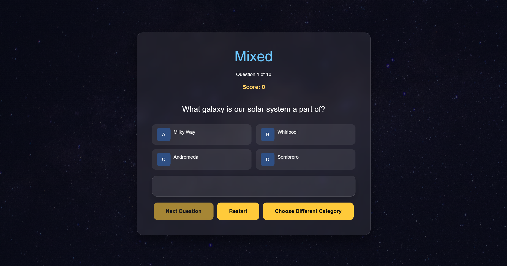
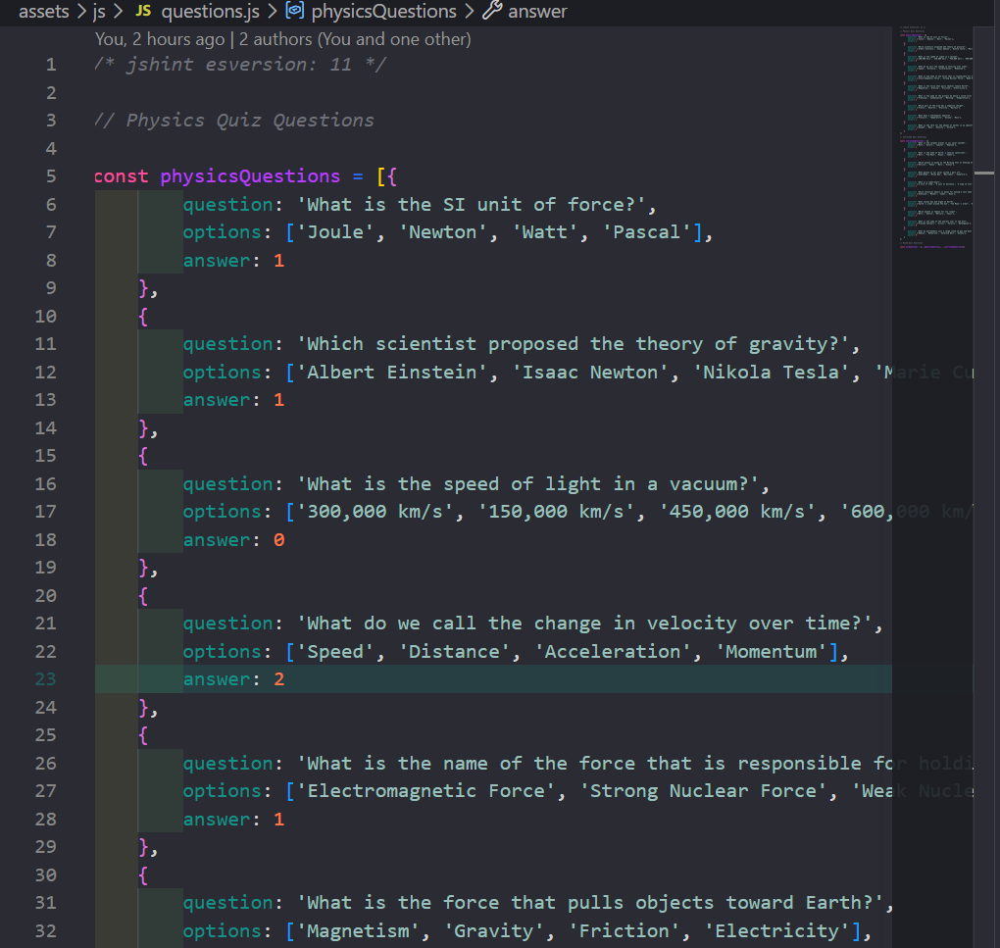

### Start Button

As a user, I want to start the quiz by clicking a Start button so that I can begin answering questions.

**Acceptance Criteria:**

- [] Clicking the Start Quiz button begins the quiz.
- [] The welcome screen is hidden.
- [] The first question is displayed.

**Implementation Tasks:**

- [] Create a Start Quiz button.
- [] Add an event listener to detect button clicks.
- [] Initialise the quiz variables and display the first question.

In the end, the group decided it was unecessary to implement a start button and have the quiz start once a category was seclected. We may switch it up and create a start button in the future!

### Question Layout

As a user, I want to start the quiz by clicking a Start button so that I can begin answering questions.

**Acceptance Criteria:**

- [] Clicking the Start Quiz button begins the quiz.
- [x] The welcome screen is hidden.
- [x] The first question is displayed.

**Implementation Tasks:**

- [] Create a Start Quiz button.
- [x] Add an event listener to detect button clicks.
- [x] Initialise the quiz variables and display the first question.

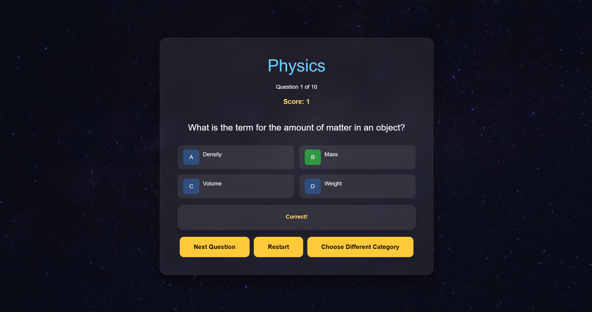

### Four-Response Layout

As a user, I want to select one answer from four options so that I can submit my response.

**Acceptance Criteria:**

- [x] Only one answer can be selected per question.
- [x] The selected answer is visually highlighted.
- [x] The selected answer is stored for scoring.

**Implementation Tasks:**

- [x] Create clickable answer buttons.
- [x] Add CSS styling to indicate the selected answer.
- [x] Store the user's selected answer in JavaScript.

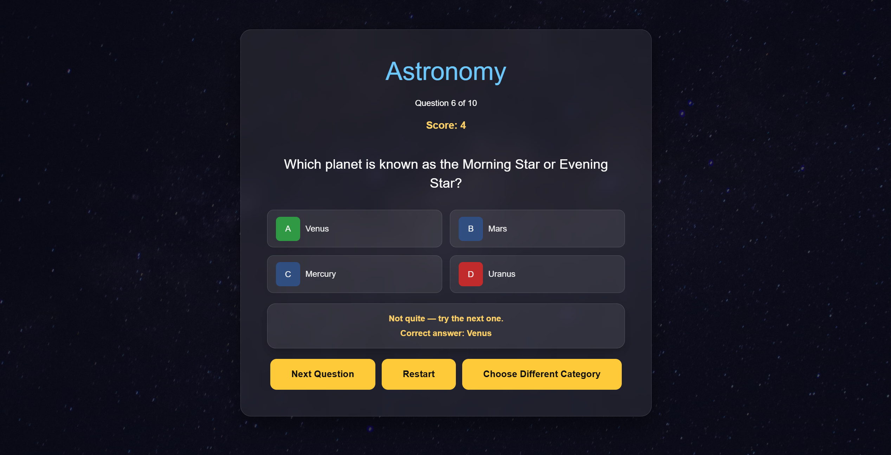

### Next Question Button

As a user, I want to select one answer from four options so that I can submit my response.

**Acceptance Criteria:**

- [x] Only one answer can be selected per question.
- [x] The selected answer is visually highlighted.
- [x] The selected answer is stored for scoring.

**Implementation Tasks:**

- [x] Create clickable answer buttons.
- [x] Add CSS styling to indicate the selected answer.
- [x] Store the user's selected answer in JavaScript.

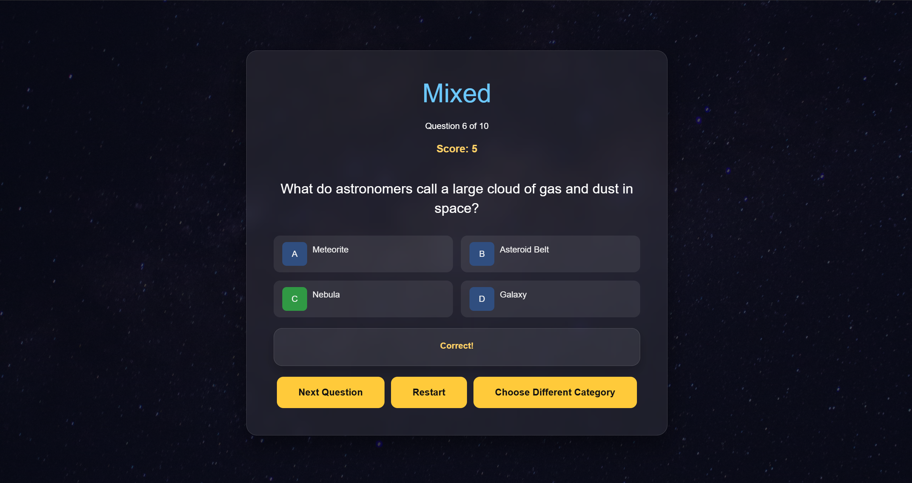

### Current Score

As a user, I want to select one answer from four options so that I can submit my response.

**Acceptance Criteria:**

- [x] Only one answer can be selected per question.
- [x] The selected answer is visually highlighted.
- [x] The selected answer is stored for scoring.

**Implementation Tasks:**

- [x] Create clickable answer buttons.
- [x] Add CSS styling to indicate the selected answer.
- [x] Store the user's selected answer in JavaScript.

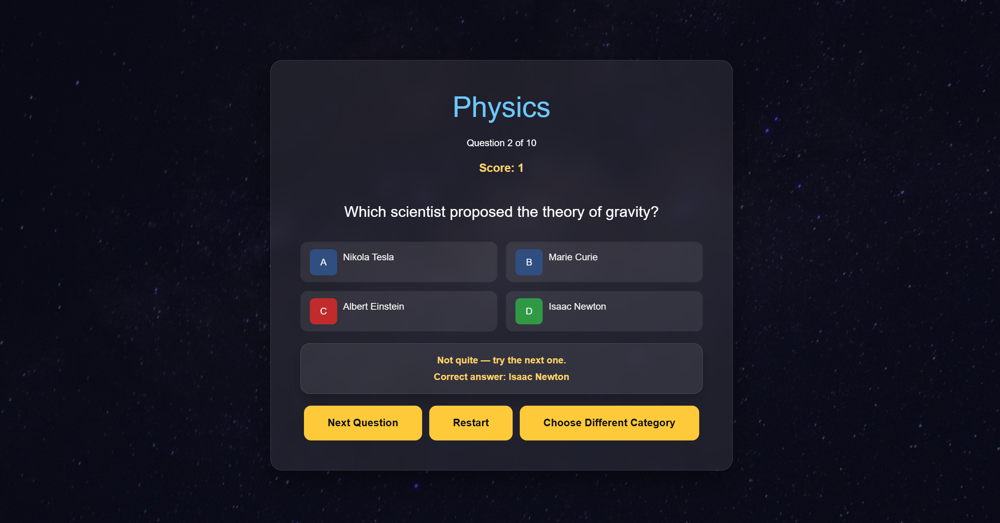

### Correct or Incorrect

As a user, I want to receive feedback indicating whether my answer was correct or incorrect so that I can learn from my mistakes.

**Acceptance Criteria:**

- [x] A message is displayed indicating whether the selected answer is correct or incorrect.
- [x] Feedback is shown before moving to the next question.
- [x] The correct answer is clearly identified when the user answers incorrectly.

**Implementation Tasks:**

- [x] Create a feedback section in the interface.
- [x] Display different messages for correct and incorrect answers.
- [x] Use CSS to style the feedback with appropriate colours or icons.

>Correct answer
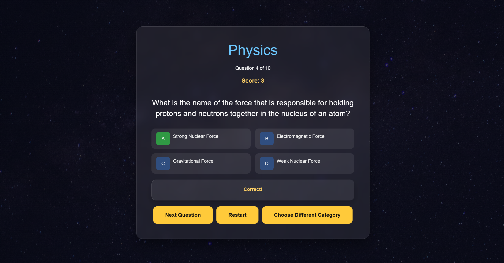
>Incorrect answer
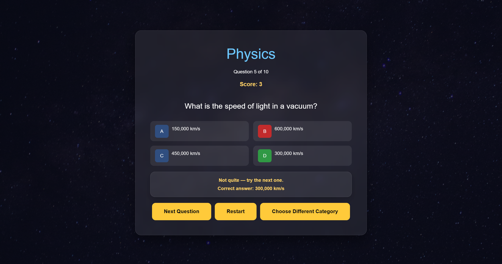

### Randomness

As a user, I want to receive feedback indicating whether my answer was correct or incorrect so that I can learn from my mistakes.

**Acceptance Criteria:**

- [x] A message is displayed indicating whether the selected answer is correct or incorrect.
- [x] Feedback is shown before moving to the next question.
- [x] The correct answer is clearly identified when the user answers incorrectly.

**Implementation Tasks:**

- [x] Create a feedback section in the interface.
- [x] Display different messages for correct and incorrect answers.
- [x] Use CSS to style the feedback with appropriate colours or icons.

>Correct answer

>Incorrect answer

### Final Score

As a user, I want to see my final score when the quiz ends so that I know how well I performed.

**Acceptance Criteria:**

- [x] A results screen is displayed after the final question.
- [x] The user's final score is shown.
- [x] The total number of correct answers is displayed.

**Implementation Tasks:**

- [x] Create a results screen.
- [x] Calculate the user's final score.
- [x] Hide the quiz interface and display the results page.

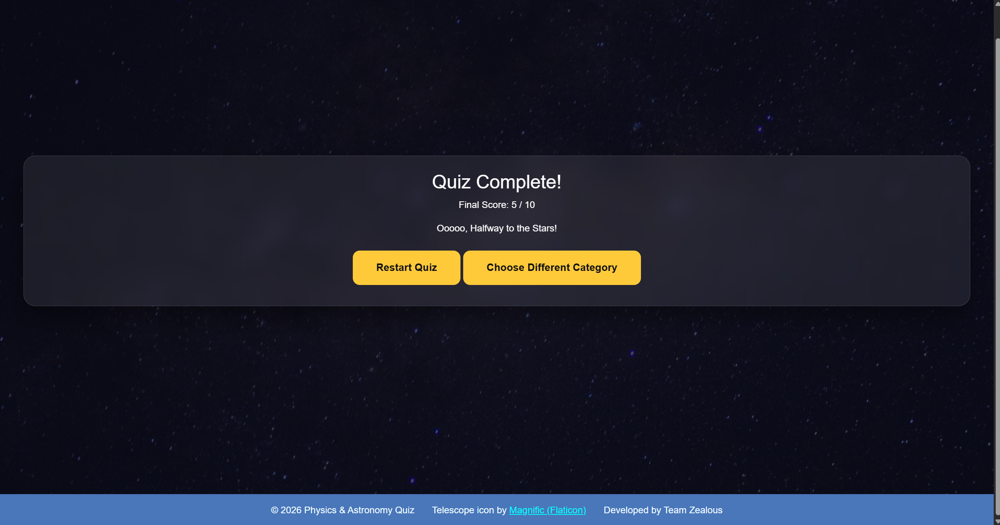

### Performance Level

As a user, I want to know my performance level so that I understand my result.

**Acceptance Criteria:**

- [x] A personalised message is displayed based on the final score.
- [x] Different score ranges display different messages.
- [x] The final score is shown alongside the result message.

**Implementation Tasks:**

- [x] Create score ranges.
- [x] Display the appropriate result message.
- [x] Style the results section.

>Score: 1/10
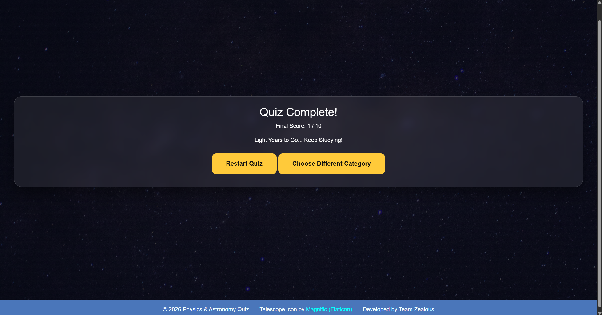
>Score: 5/10

>Score: 7/10
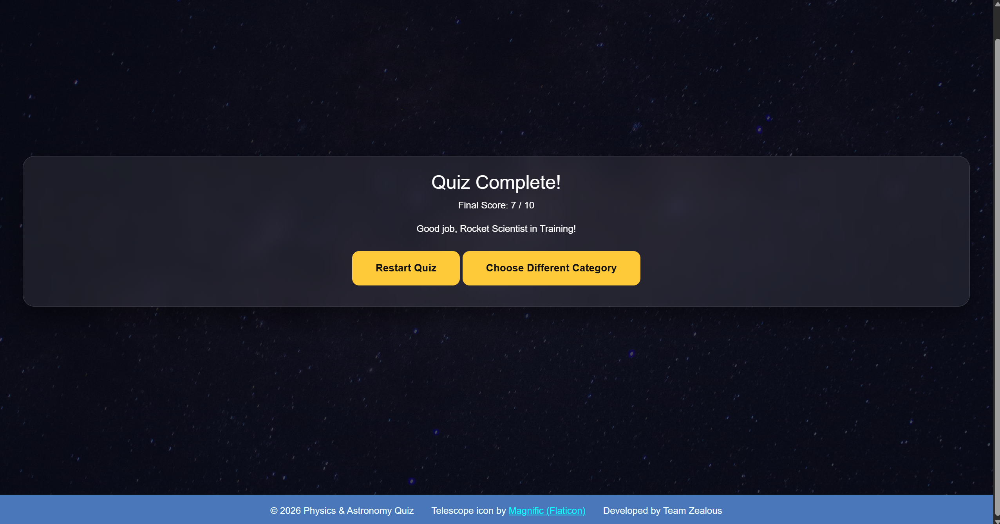
>Score: 10/10
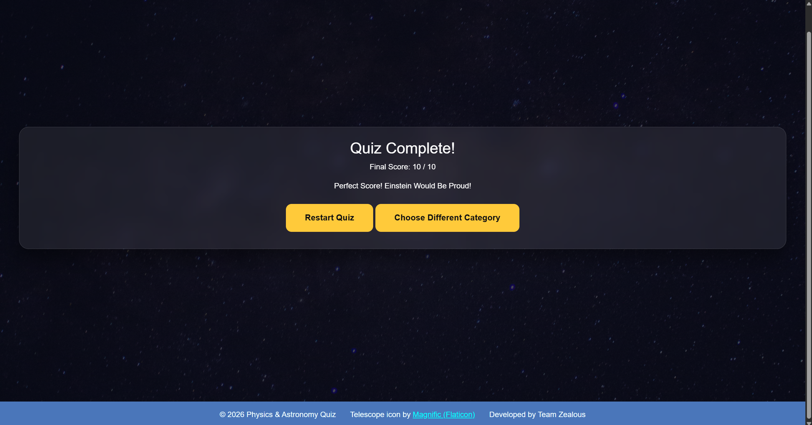