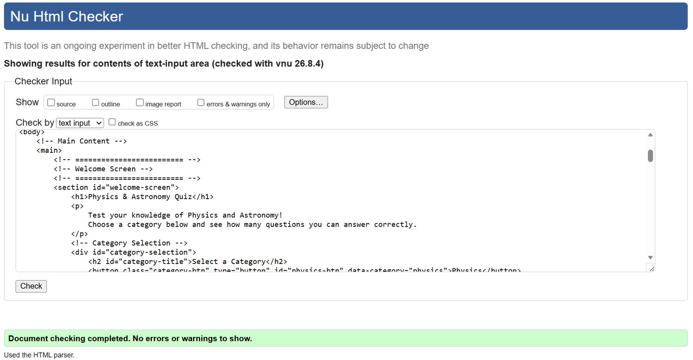
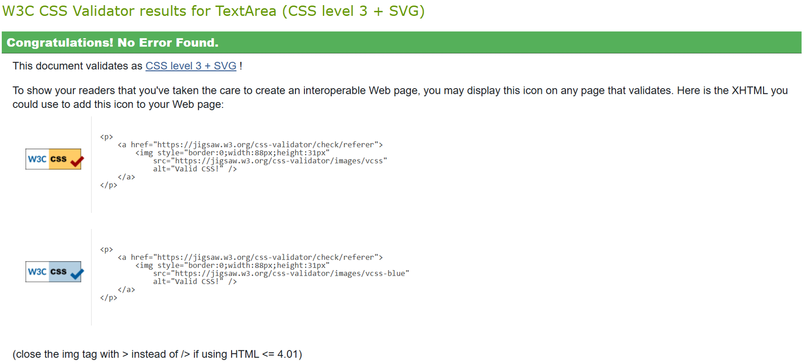
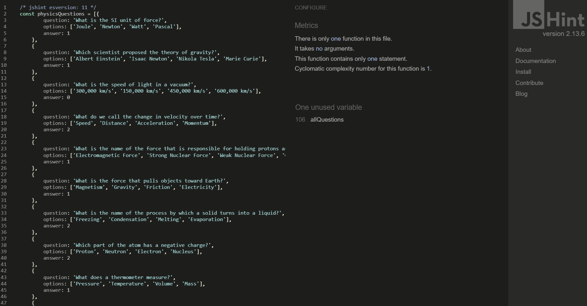
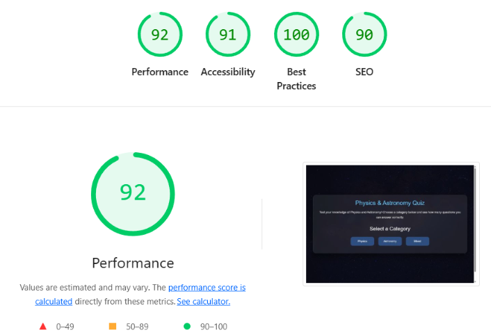
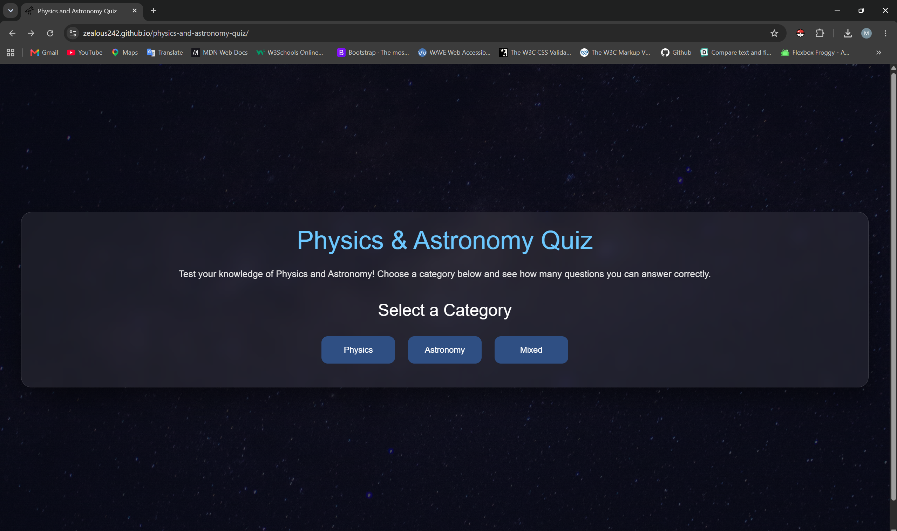
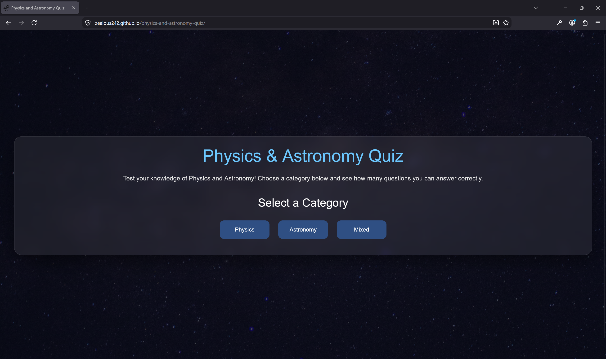
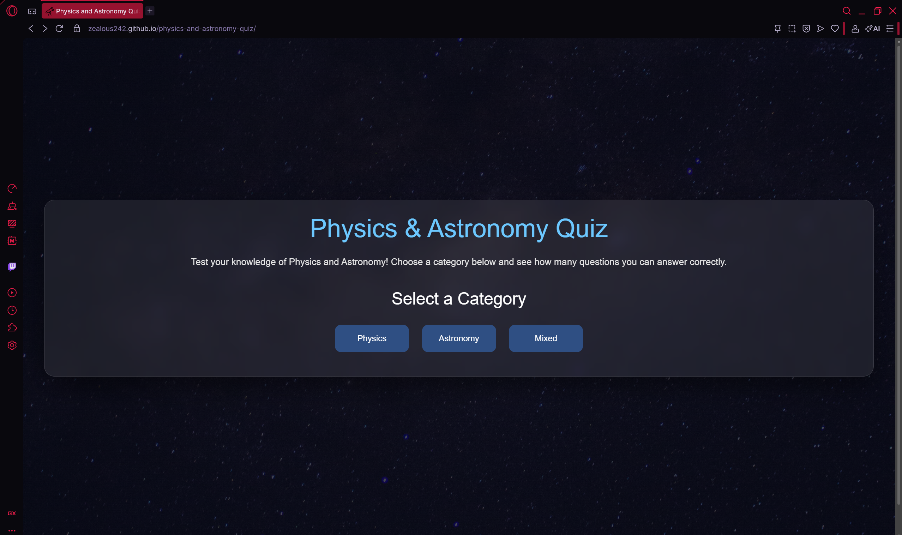
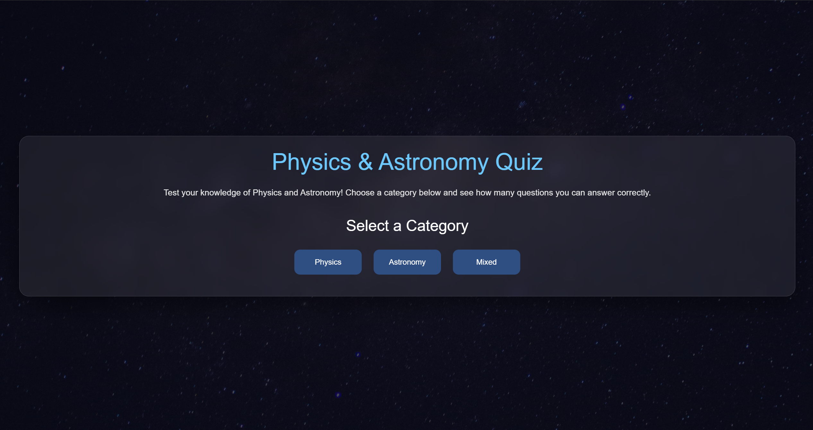
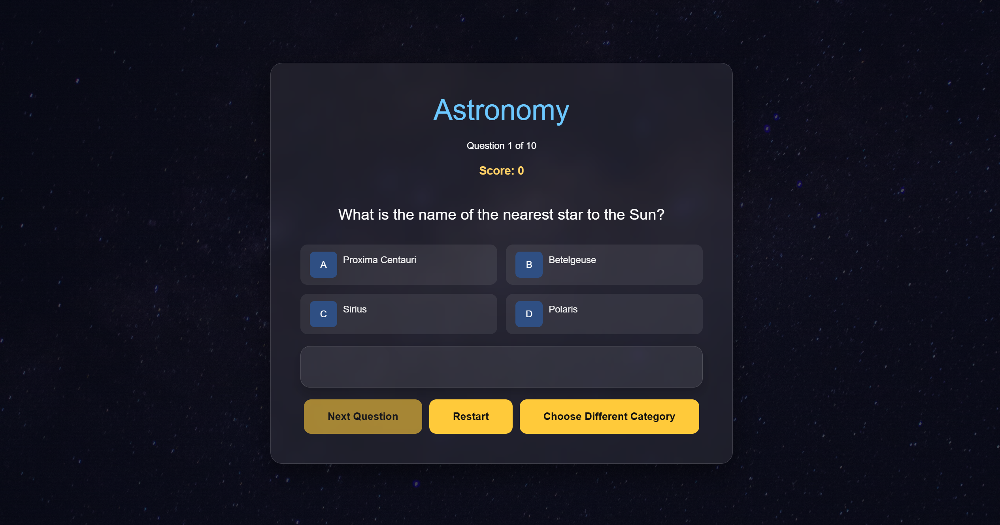

# Physics & Astronomy Quiz TESTING

initial-push

## Tests done

>HTML

>CSS

>JS

>JS - Qestions

>Lighthouse - Desktop

>Lighthouse - Mobile

>Google Chrome

>Mozilla Firefox - Developer Edition

>Opera GX

## User Stories

### Welcome Screen

As a user, I want to view a welcome screen so that I understand the purpose of the quiz

**Acceptance Criteria:**

- [x] The welcome screen is displayed when the website loads.
- [x] The page includes the quiz title and a brief description.
- [] A Start Quiz button is clearly visible.

**Implementation Tasks:**

- [x] Create the HTML structure for the welcome screen.
- [x] Style the welcome screen using CSS.

### Quiz Category

As a user, I want to select a quiz category (Physics, Astronomy, or Mixed) so that I can choose the topics I want to be tested on.

**Acceptance Criteria:**

- [x] The user can choose one category before starting the quiz.
- [x] The selected category determines which questions are displayed.
- [x]Selecting Mixed displays questions from both Physics and Astronomy.

**Implementation Tasks:**

- [x] Create category selection buttons or a dropdown menu.
- [x] Store the selected category in JavaScript.
- [x] Filter the question list based on the selected category.

>Catrgories Test

### Question Layout

As a user, I want to start the quiz by clicking a Start button so that I can begin answering questions.

**Acceptance Criteria:**

- [] Clicking the Start Quiz button begins the quiz.
- [x] The welcome screen is hidden.
- [x] The first question is displayed.

**Implementation Tasks:**

- [] Create a Start Quiz button.
- [x] Add an event listener to detect button clicks.
- [x] Initialise the quiz variables and display the first question.

